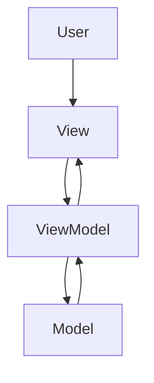

# 📐 MVVM Architecture in Android

A **beginner-friendly yet professional guide** to the **MVVM (Model-View-ViewModel)** architecture pattern in Android, with real-world examples, diagrams, and best practices.

---

## 1️⃣ Introduction

**MVVM** stands for **Model–View–ViewModel**.  
It is one of the most widely used **architectural design patterns** in Android development.

### Why MVVM is popular in Android:
- Officially recommended by **Google**.
- Fits perfectly with **Android Jetpack** components.
- Makes code **cleaner, maintainable, and testable**.
- Encourages **Separation of Concerns**.

---

## 2️⃣ MVVM Components

### **Model**
- Represents the **data** and **business logic** of the app.
- Responsible for **data management** — fetching, caching, storing.
- Contains repositories, API calls, database operations.

### **View**
- The **UI layer**: Activities, Fragments, XML layouts.
- Displays data to the user and forwards user actions to the ViewModel.
- Should **not** contain business logic.

### **ViewModel**
- Acts as a **bridge** between View and Model.
- Holds **UI-related data** and **business logic**.
- Survives configuration changes (e.g., screen rotation).
- Exposes data via **LiveData / StateFlow** for observation.

---

## 3️⃣ How MVVM Works in Android

**Data Flow in MVVM:**
1. **User interacts** with the View (e.g., taps a button).
2. View **delegates the event** to the ViewModel.
3. ViewModel **updates or fetches data** from the Model.
4. Model returns **data updates** to the ViewModel.
5. ViewModel **emits changes** via LiveData/StateFlow.
6. View **observes changes** and updates the UI automatically.

---

## 4️⃣ Advantages & Disadvantages

| ✅ Advantages | ⚠️ Disadvantages |
|--------------|-----------------|
| Clear **Separation of Concerns** | Can be **overkill** for very small projects |
| Easy to **unit test** ViewModel logic | Requires **more initial setup** |
| Survives configuration changes | Learning curve for beginners |
| Works well with Jetpack (ViewModel, LiveData, Hilt) | Can become **bloated** if not well-structured |

---

## 5️⃣ Real-World Example

### **Use Case:** Display a list of users from an API.

---

#### **Model (Repository Layer)**

```kotlin
// User.kt (Data Model)
data class User(val id: Int, val name: String)

// UserRepository.kt
class UserRepository {
    fun getUsers(): List<User> {
        // Simulated API/DB call
        return listOf(
            User(1, "Sai Hemanth"),
            User(2, "John Doe")
        )
    }
}
````

---

#### **ViewModel**

```kotlin
class UserViewModel : ViewModel() {

    private val repository = UserRepository()
    private val _users = MutableLiveData<List<User>>()
    val users: LiveData<List<User>> get() = _users

    fun loadUsers() {
        _users.value = repository.getUsers()
    }
}
```

---

#### **View (Activity/Fragment)**

```kotlin
class MainActivity : AppCompatActivity() {

    private lateinit var viewModel: UserViewModel

    override fun onCreate(savedInstanceState: Bundle?) {
        super.onCreate(savedInstanceState)
        setContentView(R.layout.activity_main)

        viewModel = ViewModelProvider(this).get(UserViewModel::class.java)

        // Observe LiveData
        viewModel.users.observe(this) { userList ->
            // Update UI (RecyclerView, etc.)
            println("Users: $userList")
        }

        // Trigger data load
        viewModel.loadUsers()
    }
}
```

---

## 6️⃣ Best Practices for MVVM in Android

* **Keep Views “dumb”** — no business logic inside Activities/Fragments.
* Use **LiveData** or **StateFlow** to observe data changes.
* **Inject dependencies** with Hilt or Dagger instead of creating them in ViewModel.
* Organize your project with **separate packages** for `model`, `view`, `viewmodel`.
* Keep ViewModels **UI-focused** — avoid direct database/network calls inside them.

---

## 7️⃣ MVVM Architecture Diagram



---

## 8️⃣ MVVM vs MVP vs MVC

| Pattern  | Description                                               | Android Usage                   |
| -------- | --------------------------------------------------------- | ------------------------------- |
| **MVC**  | View talks directly to Model                              | Legacy Android, not recommended |
| **MVP**  | Presenter acts as middleman                               | Popular before MVVM             |
| **MVVM** | ViewModel holds UI state and logic, View observes changes | **Recommended** by Google       |

---

## 9️⃣ Useful Libraries & Tools for MVVM

* **Jetpack ViewModel** – Lifecycle-aware ViewModels
* **LiveData / StateFlow** – Observable data holders
* **Data Binding / View Binding** – Bind UI to data
* **Hilt/Dagger** – Dependency injection
* **Room** – Local database
* **Retrofit/OkHttp** – Networking

---

## 🔗 References

* [Google Android Architecture Guide](https://developer.android.com/jetpack/guide)
* [Guide to app architecture](https://developer.android.com/jetpack/guide#recommended-app-arch)
* [MVVM Pattern Wikipedia](https://en.wikipedia.org/wiki/Model–view–viewmodel)

---

## 📜 License

This document is released under the [MIT License](LICENSE).
